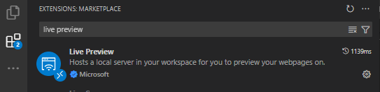
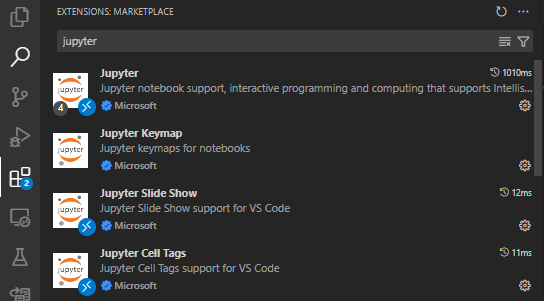
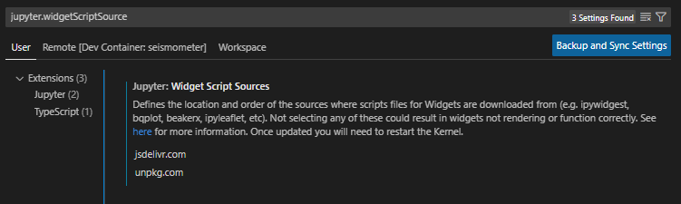

.. _faq:

================================
Frequently Asked Questions (FAQ)
================================

.. _no_events_dataset:

Using Seismometer without an events dataset
-------------------------------------------

In case your predictions dataset already includes a specified target, you can 
avoid merging in any events data and still leverage the model performance evaluations
available in ``seismometer``.

Update the ``usage_config.yml``'s ``data_usage`` section, removing any lines
that reference the ``events`` or ``event_table`` definitions. Also validate that
the ``primary_target`` matches the name of the target column in your dataset.

.. code-block:: yaml
   :emphasize-removed: 19, 20, 21, 22, 23, 24, 25, 26, 27, 28
   :emphasize-lines: 6

   # usage_config.yml
   data_usage:
      entity_id: patient_nbr
      context_id: encounter_id
      primary_output: LGBM_score
      primary_target: Readmitted within 30 Days
      predict_time: ScoringTime
      features:
         - admission_type_id
         - num_medications
         - num_procedures
      cohorts:
         - source: age
           display_name: Age
         - source: race
           display_name: Race
         - source: gender
           display_name: Gender
      event_table:
         type: Type
         time: EventTime
         value: Value
      events:
         - source: TargetLabel
           display_name: Readmitted within 30 Days
           window_hr: 6
           offset_hr: 0
           usage: target
      censor_min_count: 10

Then, adjust your ``config.yml`` to remove any reference to an ``events`` dataset.

.. code-block:: yaml
   :emphasize-removed: 6, 9

   # config.yml
   other_info: 
      usage_config: "usage_config.yml"
      template: "binary"
      info_dir: "outputs"
      event_definition: "dictionary.yml"
      prediction_definition: "dictionary.yml"
      data_dir: "data"
      event_path: "events.parquet"
      prediction_path: "predictions.parquet"
      metadata_path: "metadata.json"

.. note:: 
   You can still use an events dataset in combination with a target in your 
   predictions dataset. Don't tag any events in the ``data_usage`` configuration
   with ``usage: target`` and everything else should work as intended.

.. seealso::
   :ref:`config-files`

.. _risk-groups-as-cohorts:

Adding risk groups as a cohort
------------------------------

The following configuration file demonstrates an example of adding
risk groups as a possible cohort for analysis. Make sure your cohort defines 
a ``display_name`` for the new cohort that is different from the underlying 
score column, otherwise you will replace the existing column in the loaded dataframe.

.. code-block:: yaml
   
   # usage_config.yml
   data_usage:
     # other configured data usage ...
     cohorts:
       # other configured cohorts ...
       - source: Score
         display_name: Risk Group
         splits:
           - 0.08
           - 0.15
           - 0.30

.. _vscode-feature-reports:

Viewing feature reports in Visual Studio Code
---------------------------------------------

By default, Visual Studio Code does not come with a way to view rendered 
HTML. To support this, navigate to the Visual Studio Code extension marketplace
and ensure you have the Live Preview extension installed and enabled:

With the extension enabled, you can right-click on HTML files in the Visual Studio
Code file explorer and select ``Show Preview`` to view the file as rendered HTML.

.. _vscode-selectors:

Selectors don't show in Visual Studio Code
------------------------------------------
Occasionally, using notebooks in Visual Studio Code will result in broken 
selectors, widgets, or visualizations.

Visual Studio Code relies on support files from a third party website that
need additional configuration.

First, navigate to the Visual Studio Code extension marketplace and ensure
you have the Jupyter extension installed and enabled:

Then, open your Visual Studio Code extension settings (``Ctrl+,`` on Windows or ``Cmd+,`` on Mac),
search for ``jupyter.widgetScriptSources``, and add ``jsdelivr.com`` and ``unpkg.com`` to the list.

.. seealso::
   `Visual Studio Code's support for IPyWidgets <https://github.com/microsoft/vscode-jupyter/wiki/IPyWidget-Support-in-VS-Code-Python>`_
