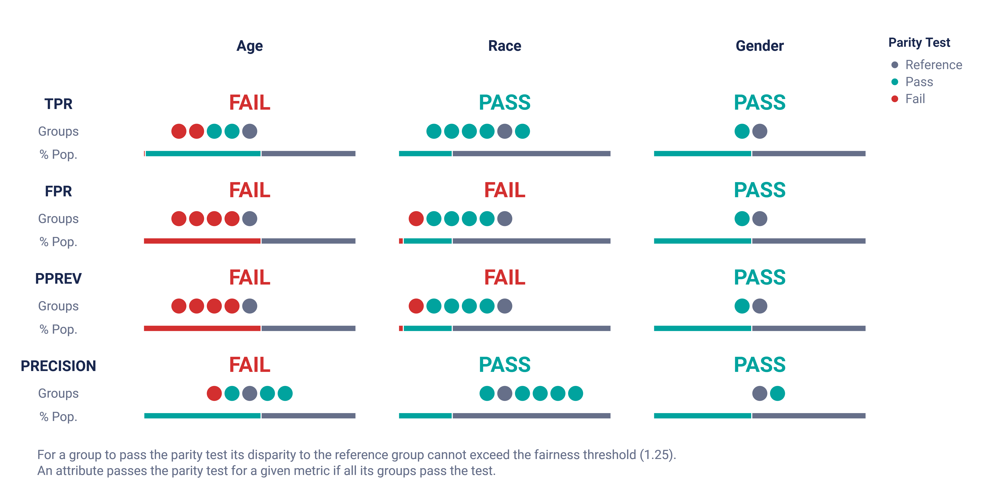

.. _user_guide:

==========
User Guide
==========

``seismometer`` allows you to evaluate AI model performance using standardized evaluation criteria that helps you
make decisions based on your own local data. It helps you
validate a model's initial performance and continue to monitor its
performance over time.

Local validation of an AI model requires cross-referencing data about
patients (such as demographics and clinical outcomes) and model
performance (including inputs and outputs).

This guide provides instructions on how to customize and use a Notebook.

Common terms
============

This section provides a list of terms used throughout this guide that
you might not be familiar with:

-  *Cohort attribute*. An attribute that groups a set of patients that
   share a similar trait. For example, the Notebook might allow you to
   analyze data by race, sex, or other demographic criteria. It also
   might let you analyze data by other criteria, such as patients seen
   within a specific department or hospital.

-  *Cohort*. A set of patients that share a cohort attribute.

-  *Event*. A defined relevant action or occurrence that is important in
   understanding the workflows and outcomes that might be influenced
   through usage of the model.

-  *Prediction*. The output provided by the model. One prediction is
   specified as a key output.

-  *Feature*. A column of data used as an input to the model.

Generating a Notebook
=====================

Generating a Notebook requires three pieces of information:

- Template Notebook: A template Notebook that is suitable for your model.
- Configuration files: A ``config.yml`` file to specify location of required data and/or other configuration files (refer to the :ref:`config-files`).
- Supplemental info: Explanatory markdown files and model-specific supplements to guide the analysis (refer to the :ref:`config-files`).

Each template Notebook is associated with a collection of markdown files. Your markdown files are used to fill the corresponding
markdown file in the template Notebook to generate a Notebook. To extract the expected markdown files
from the template Notebook, you can run the following:

.. code-block:: bash

   seismometer extract --template binary

If the command is not run from the same directory as your ``config.yml`` file, use

.. code-block:: bash

   seismometer extract --template binary --config_yaml {path_to_base_config_file}

In the above example, we are using the ``binary`` template. Run

.. code-block:: bash

   seismometer extract --help

for more details on available templates and arguments.

Update the markdown files with content relevant to your model or replace them with model-specific markdown files
provided by the model developer.

After updating the markdown files with content for the model, generate a Notebook by running

.. code-block:: bash

   seismometer build [--config_yaml] {path_to_base_config_file}

.. seealso::
   :ref:`cli` for more details on the CLI and :ref:`api.internals` for more information on build and extract commands.

Using the Binary Classifier Notebook
====================================

Each Notebook provides a summary and analysis for a single model.
Initially, we are providing a Binary Classifier Notebook template for
predictive models that generate a single output.

Usage
-----

Provides a summary of the data included in the Notebook, such as time
period of the analysis and number of predictions made by the model.

It also provides definitions of terms used throughout the Notebook.

Overview
--------

Provides background information provided by the model developer to help
you understand the intention and use cases for model predictions.

Feature Monitor
---------------

Provides details on the features included in the dataset.

Feature Alerts
~~~~~~~~~~~~~~

Review insights into potential data quality issues that might have been
identified while generating the Notebook. Review any alerts to verify
that your dataset includes complete details for analysis. Alerts might
indicate that all necessary information was not extracted into your
dataset or that your workflows are not always capturing the data needed
to make accurate predictions.

Feature Summary Statistics and Plots
~~~~~~~~~~~~~~~~~~~~~~~~~~~~~~~~~~~~

View the summary statistics and distributions for the model inputs in
your dataset.

Summarize Features by Cohort Attribute
~~~~~~~~~~~~~~~~~~~~~~~~~~~~~~~~~~~~~~

Select a cohort attribute and two distinct sets of cohorts to see a
breakdown of your features stratified by the different cohorts.

Summarize Features by Target
~~~~~~~~~~~~~~~~~~~~~~~~~~~~

View a breakdown of your features stratified by the different target
values.

Model Performance
-----------------

Provides standardized distribution plots to evaluate model performance.
Analysis is available for each prediction and encounter.

ROC Curve
~~~~~~~~~

The receiver operating characteristic (ROC) curve shows the sensitivity
and specificity across all possible thresholds for the model. This plot
can help you assess both in aggregate and at specific thresholds how
often the model correctly identifies positive cases and negative cases.
The AUROC or C-stat is the area under the ROC curve and provides a single measure
of how well the model performs across thresholds. The AUROC does not
assess performance at a specific threshold.

.. image:: media/ROC.png
   :alt: A graph with a curve Description automatically generated
   :width: 3.5in

Sensitivity/Flag Curve
~~~~~~~~~~~~~~~~~~~~~~

This curve plots the sensitivity and flag rate across all possible
thresholds for the model. Sensitivity is a model's true positive rate,
or the proportion of entities in the dataset that met the target
criteria and were correctly scored above the threshold set for the
model. The flag rate is the proportion of entities identified as
positive cases by the model at the selected threshold.

This plot can help you determine how frequently your model would trigger
workflow interventions at different thresholds and how many of those
interventions would be taken for true positive cases. The highlighted
area above the curve indicates how many true positives would be missed
at this threshold.

.. image:: media/sensitivity_flagrate.png
   :alt: A graph of a curve Description automatically generated
   :width: 3.5in

Calibration Curve
~~~~~~~~~~~~~~~~~

The calibration curve is a measure of how reliable a model is in its
predictions at a given threshold. It plots the observed rate (what
proportion of cases at that threshold are true positives) against the
model's predicted probability. Points above the y=x line indicate that a
model is overconfident in its predictions (meaning that it identifies
more positive cases than exist), and points below the y=x line indicate
that a model is underconfident in its predictions (it identifies fewer
positive cases than exist).

Note the following when using a calibration curve, particularly with a
defined threshold or with sampling:

-  Sampling changes the observed rate, so the calibration curve might
   not be relevant if it is used.

-  Thresholds collapse the calibration curve above that probability. For
   example, if a workflow checks for outputs >= 15, then a score of 99
   and a score of 15 are treated the same in that workflow.

.. image:: media/observed_rate_predicted_probability.png
   :alt: A graph with a blue line and red dots Description automatically generated
   :width: 3.5in

PR Curve
~~~~~~~~

The precision-recall curve shows the tradeoff between precision and
recall for different thresholds across all possible thresholds for the
model. Precision is the positive predictive value of a model (how likely
an entity above the selected threshold is to have met the target
criteria). Recall is a model's true positive rate (the proportion of
entities in the dataset that met the target criteria and were correctly
scored above the threshold set for the model).

This plot can help you assess the tradeoffs between identifying more
positive cases and correctly identifying positive cases.

.. image:: media/ppv_sensitivity.png
   :alt: A graph with a line and numbers Description automatically generated
   :width: 3.5in

Sensitivity/Specificity/PPV Curve
~~~~~~~~~~~~~~~~~~~~~~~~~~~~~~~~~

This curve shows sensitivity, specificity, and precision (positive
predictive value or PPV) across all possible thresholds for a model, and
it can help you identifying thresholds where your model has high enough
specificity, sensitivity, and PPV for your intended workflows.

.. image:: media/threshold_metric.png
   :alt: A graph of a graph Description automatically generated with medium confidence
   :width: 3.5in

Predicted Probabilities
~~~~~~~~~~~~~~~~~~~~~~~

This curve shows predicted probabilities for entities in the dataset
stratified by whether or not they met the target criteria. It can help
you identify thresholds where your model correctly identifies enough of
the true positives without identifying too many of the true negatives.

.. image:: media/predicted_count.png
   :width: 3.5in

Fairness Audit
--------------

A fairness audit can help you evaluate whether the model performs
differently across groups within a cohort relative to a reference
cohort. Fairness evaluations are useful in identifying areas
for further investigation, but note that they do not necessarily reveal a
problem that requires correction. It is mathematically impossible to
ensure parity across many definitions simultaneously, so you might focus
on a predetermined set while remaining aware of the others.

This audit should be used by experts with a deep understanding of the
model and the context in which the predictions are used. Even when a
metric is flagged as failing in the fairness audit, there might be
context that explains and even predicts the difference. Like many
concepts, a single parity concept can have several different names;
notably, parity of true positive rate is equal opportunity, parity of
false positive rate is predictive equality, and parity of predictive
prevalence is demographic parity.

An Aequitas audit gives an overview of parity across all defined groups
for each cohort attribute. By default, the majority group is the
baseline and a statistic for all observations in the other groups is
compared. A fairness threshold such as 125% is then used to classify the
ratio of each group to the reference. If any group performs differently,
above (125% in our example) or below (80%) then it is considered a
failure for that cohort/metric.

The visualization is a table showing the overall pass/fail, an ordered
list of circles representing the groups, and a bar representing the
percentage of the population data in reference. Note that comparison
across columns is not always exact due to potential differences in the
included observations from missing information. Hovering over a bar or
circle shows details on the group and metric.

Cohort Analysis
---------------

Breaks down the overall analysis by various cohorts defined for the
model.

Performance by Cohort
~~~~~~~~~~~~~~~~~~~~~

Select a cohort and one or more subgroups to see a breakdown of common model
performance statistics across thresholds and cohort attributes. The plots show
sensitivity, specificity, proportion of flagged entities, PPV, and NPV.

Outcomes
--------

Trend Comparison
~~~~~~~~~~~~~~~~

The goal of operationalizing models is to improve outcomes so analyzing
only model performance is usually too narrow a view to take. This
section shows broader indicators such as outcomes in relation to the
assisted intervention actions. Plots trend selected events split out
against the selected cohorts to reveal associations between
interventions that the model is helping drive and the outcomes that the
intervention helps modify.

.. image:: media/outcomes.png
   :alt: A graph showing different colored lines Description
      automatically generated
   :width: 7.5in

Lead Time Analysis
~~~~~~~~~~~~~~~~~~

View the amount of time that a prediction provides before an event of
interest. These analyses implicitly restrict data to the positive
cohort, as that is expected to be the time the event occurs. The
visualization uses standard violin plots where a density estimate is shown as a filled
region and quartile and whiskers inside that area. When the cohorts overlap significantly,
this indicates the model is providing equal opportunity for action to be
taken based on the outputs across the cohort groups.

.. image:: media/time_lead_analysis.png
   :alt: A graph with colorful rectangular bars Description
      automatically generated with medium confidence
   :width: 5in

Customizing the Notebook
========================

You can customize the Notebook as needed by running Python code. This
section includes tasks for common updates that you might make within the
Notebook.

.. _config-files:

Create Configuration Files
==========================

Configuration files provide the instructions and details needed to build
the Notebook for your dataset. It can be provided in one or several YAML
files. The configuration includes several sections:

-  Definitions for the columns included in the predictions table,
   including the column name, data type, definition, and display
   name.

-  Definitions of the events included in the events table.

-  Data usage definitions, including primary and secondary IDs, primary targets
   and output, relevant features, cohorts to allow for selection, abd outcome
   events to show in the Notebook.

-  Other information to define which files contain the information needed for the Notebook

Create a Data Dictionary
------------------------

The data dictionary is a set of datatypes, friendly names, and definitions for
columns in your dataset. As of the current version of ``seismometer``, this configuration
is not strictly required.

.. code-block:: yaml

   # dictionary.yml
   # Can be separated into two files, this has both predictions and events
   # This should describe the data available, but not necessarily used
   predictions:
      - name: patient_nbr
        dtype: str
        definition: The patient identifier.
      - name: encounter_id
        dtype: str
        definition: The contact identifier.
      - name: LGBM_score
        dtype: float
        display_name: Readmission Risk
        definition: |
           The Score of the model.
      - name: ScoringTime
        dtype: datetime
        display_name: Prediction Time
        definition: |
           The time at which the prediction was made.
      - name: age
        dtype: category
        display_name: Age
        definition: The age group of the patient.

   events:
      - name: TargetLabel
        display_name: 30 days readmission
        definition: |
           A binary indicator of whether the diabetes patient was readmitted within 30 days of discharge
        dtype: bool

Create Usage Configuration
--------------------------

The usage configuration helps ``seismometer`` understand what different elements
in your dataset are `used` for and is defined in a single YAML file. Here you will label
identifier columns, score columns, features to load and analyze, features to use as cohorts,
and how to merge in events. Events are typically stored in a separate dataset so they can be
flexibly merged multiple times based on different definitions. Events typically encompass
targets, interventions, and outcomes associated with an entity.

.. code-block:: yaml

   # usage_config.yml
   data_usage:
      # Define the keys used to identify an output;
      entity_id: patient_nbr # required
      context_id: encounter_id # optional, secondary grouper
      # Each use case must define a primary output and target
      # Output should be in the predictions table but target may be a display name of a windowed event
      primary_output: LGBM_score
      primary_target: Readmitted within 30 Days
      # Predict time indicates the column for timestamp associated with the row
      predict_time: ScoringTime
      # Features, when present, will reduce the data loaded from predictions.
      # It does NOT need to include cohorts our outputs specified elsewhere
      features:
         - admission_type_id
         - num_medications
         - num_procedures
      # This list defines available cohort options for the default selectors
      cohorts:
         - source: age
           display_name: Age
         - source: race
           display_name: Race
         - source: gender
           display_name: Gender
      # The event_table allows mapping of event columns to those expected by the tool
      # The table must have the entity_id column and may have context_id column if being used
      event_table:
         type: Type
         time: EventTime
         value: Value
      # Events define what types of events to merge into analyses
      # Windowing defines the range of time prior to the event where predictions are considered
      events:
         - source: TargetLabel
           display_name: Readmitted within 30 Days
           window_hr: 6
           offset_hr: 0
           usage: target
           # How to combine multiple *scores* for a context_id when analyzing this event
           aggregation_method: max
      # Minimum group size to be included in the analysis
      censor_min_count: 10

.. seealso::
   A separate events dataset is not required, and can be avoided if you do not need
   to include events other than the target. See: :ref:`no_events_dataset`

Create Resource Configuration
-----------------------------

The resource config is used to define the location of other configuration files
and the underlying datasets that will be loaded into ``seismometer``, and is
defined in a single YAML file.

.. code-block:: yaml

   # config.yml
   other_info:
      # Path to the file containing how to interpret data during run
      usage_config: "usage_config.yml"
      # Name of the template to use during generation
      template: "binary"
      # Directory to the location of markdown
      # Use seismometer extract to prepopulate these files
      info_dir: "outputs"
      # These two definitions define all the columns available
      event_definition: "dictionary.yml"
      prediction_definition: "dictionary.yml"
      # These are the paths to the data itself; currently expect typed parquet
      data_dir: "data"
      event_path: "events.parquet"
      prediction_path: "predictions.parquet"
      metadata_path: "metadata.json"

Create Metadata Configuration
-----------------------------

The metadata configuration is used to define two pieces of metadata about the model:
the model's name and any configured thresholds. It is typically defined in a
``metadata.json`` file and can be referenced in ``config.yml`` using the
``metadata_path`` field.

.. code-block:: json

   {
      "modelname": "Risk of Readmission for Patients with Diabetes",
      "thresholds": [0.65, 0.3]
   }
