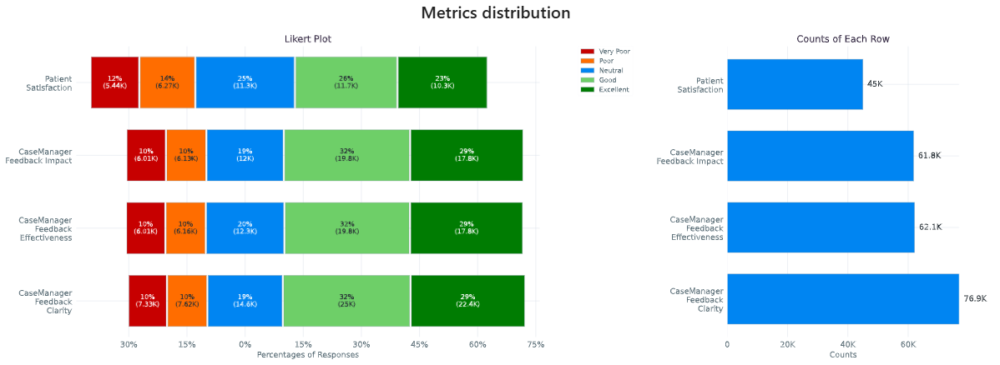
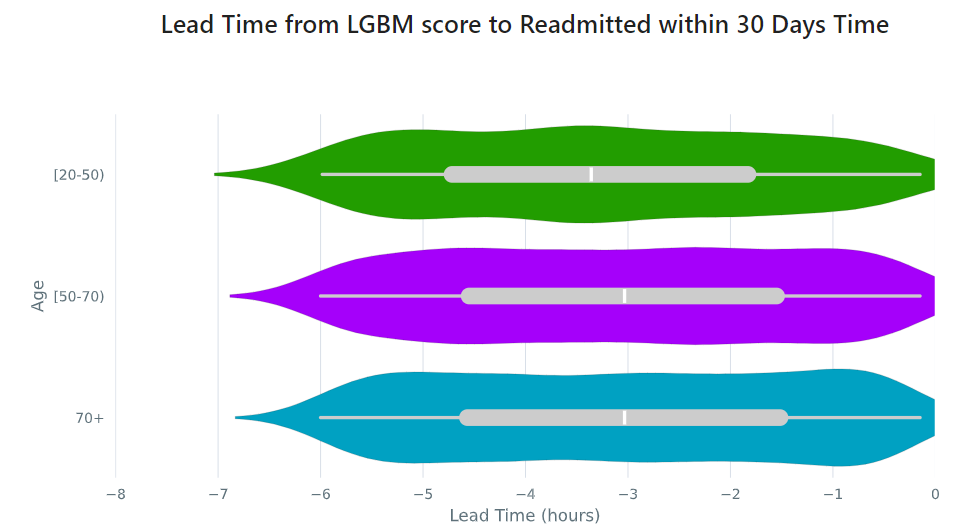

.. _user_guide:

==========
User Guide
==========

``seismometer`` allows you to evaluate AI model performance using standardized evaluation criteria that helps you
make decisions based on your own local data. It helps you
validate a model's initial performance and continue to monitor its
performance over time.

Local validation of an AI model requires cross-referencing data about
patients (such as demographics and clinical outcomes) and model
performance (including inputs and outputs).

This guide provides instructions on how to customize and use a Notebook.

Common terms
============

This section provides a list of terms used throughout this guide that
you might not be familiar with:

-  *Cohort attribute*. An attribute that groups a set of patients that
   share a similar trait. For example, the Notebook might allow you to
   analyze data by race, sex, or other demographic criteria. It also
   might let you analyze data by other criteria, such as patients seen
   within a specific department or hospital.

-  *Cohort*. A set of patients that share a cohort attribute.

-  *Event*. A defined relevant action or occurrence that is important in
   understanding the workflows and outcomes that might be influenced
   through usage of the model.

-  *Prediction*. The output provided by the model. One prediction is
   specified as a key output.

-  *Feature*. A column of data used as an input to the model.

Creating a Notebook
=====================

Creating a Seismogram (notebook) requires a couple distinct pieces of information:

- Example Notebook: Starting from example notebook, while not required, is expected to be the most straight-forward. Once several types of models are supported, it is expected that a CLI will further automate combining new content into the example structure.
- Configuration files: A ``config.yml`` file to specify location of required data and/or other configuration files (refer to the :ref:`config-files`).
- Supplemental info: Explanatory model-specific supplements to guide the analysis.

Update or replace the example notebook with content relevant to your model.

Using the Binary Classifier Notebook
====================================

Each Notebook provides a summary and analysis for a single model.
Initially, we are providing a Binary Classifier Notebook template for
predictive models that generate a single output.

Usage
-----

Provides a summary of the data included in the Notebook, such as time
period of the analysis and number of predictions made by the model.

It also provides definitions of terms used throughout the Notebook.

Overview
--------

Provides background information provided by the model developer to help
you understand the intention and use cases for model predictions.

Feature Monitor
---------------

Provides details on the features included in the dataset.

Feature Alerts
~~~~~~~~~~~~~~

Review insights into potential data quality issues that might have been
identified while generating the Notebook. Review any alerts to verify
that your dataset includes complete details for analysis. Alerts might
indicate that all necessary information was not extracted into your
dataset or that your workflows are not always capturing the data needed
to make accurate predictions.

Feature Summary Statistics and Plots
~~~~~~~~~~~~~~~~~~~~~~~~~~~~~~~~~~~~

View the summary statistics and distributions for the model inputs in
your dataset.

Summarize Features by Cohort Attribute
~~~~~~~~~~~~~~~~~~~~~~~~~~~~~~~~~~~~~~

Select a cohort attribute and two distinct sets of cohorts to see a
breakdown of your features stratified by the different cohorts.

Summarize Features by Target
~~~~~~~~~~~~~~~~~~~~~~~~~~~~

View a breakdown of your features stratified by the different target
values.

Model Performance
-----------------

Provides standardized distribution plots to evaluate model performance.
Analysis is available for each prediction and encounter.

ROC Curve
~~~~~~~~~

The receiver operating characteristic (ROC) curve shows the sensitivity
and specificity across all possible thresholds for the model. This plot
can help you assess both in aggregate and at specific thresholds how
often the model correctly identifies positive cases and negative cases.
The AUROC or C-stat is the area under the ROC curve and provides a single measure
of how well the model performs across thresholds. The AUROC does not
assess performance at a specific threshold.

.. image:: media/ROC.png
   :alt: A graph of the ROC with the AUROC included
   :width: 3.5in

Sensitivity/Flag Curve
~~~~~~~~~~~~~~~~~~~~~~

This curve plots the sensitivity and flag rate across all possible
thresholds for the model. Sensitivity is a model's true positive rate,
or the proportion of entities in the dataset that met the target
criteria and were correctly scored above the threshold set for the
model. The flag rate is the proportion of entities identified as
positive cases by the model at the selected threshold.

This plot can help you determine how frequently your model would trigger
workflow interventions at different thresholds and how many of those
interventions would be taken for true positive cases. The highlighted
area above the curve indicates how many true positives would be missed
at this threshold.

.. image:: media/sensitivity_flagrate.png
   :alt: A graph of sensitivity versus flag rate
   :width: 3.5in

Calibration Curve
~~~~~~~~~~~~~~~~~

The calibration curve is a measure of how reliable a model is in its
predictions at a given threshold. It plots the observed rate (what
proportion of cases at that threshold are true positives) against the
model's predicted probability. Points above the y=x line indicate that a
model is overconfident in its predictions (meaning that it identifies
more positive cases than exist), and points below the y=x line indicate
that a model is under-confident in its predictions (it identifies fewer
positive cases than exist).

Note the following when using a calibration curve, particularly with a
defined threshold or with sampling:

-  Sampling changes the observed rate, so the calibration curve might
   not be relevant if it is used.

-  Thresholds collapse the calibration curve above that probability. For
   example, if a workflow checks for outputs >= 15, then a score of 99
   and a score of 15 are treated the same in that workflow.

.. image:: media/observed_rate_predicted_probability.png
   :alt: A graph of the calibration curve with vertical lines representing key thresholds
   :width: 3.5in

PR Curve
~~~~~~~~

The precision-recall curve shows the tradeoff between precision and
recall for different thresholds across all possible thresholds for the
model. Precision is the positive predictive value of a model (how likely
an entity above the selected threshold is to have met the target
criteria). Recall is a model's true positive rate (the proportion of
entities in the dataset that met the target criteria and were correctly
scored above the threshold set for the model).

This plot can help you assess the tradeoffs between identifying more
positive cases and correctly identifying positive cases.

.. image:: media/ppv_sensitivity.png
   :alt: A graph of PPV versus sensitivity
   :width: 3.5in

Sensitivity/Specificity/PPV Curve
~~~~~~~~~~~~~~~~~~~~~~~~~~~~~~~~~

This curve shows sensitivity, specificity, and precision (positive
predictive value or PPV) across all possible thresholds for a model, and
it can help you identifying thresholds where your model has high enough
specificity, sensitivity, and PPV for your intended workflows.

.. image:: media/threshold_metric.png
   :alt: A graph of sensitivity, specificity, and PPV
   :width: 3.5in

Predicted Probabilities
~~~~~~~~~~~~~~~~~~~~~~~

This curve shows predicted probabilities for entities in the dataset
stratified by whether or not they met the target criteria. It can help
you identify thresholds where your model correctly identifies enough of
the true positives without identifying too many of the true negatives.

.. image:: media/predicted_count.png
   :width: 3.5in

Analytics Table
~~~~~~~~~~~~~~~

Provides a table of performance statistics to compare performance across
multiple models/scores and targets centered around two values selected
for a specific monotonic (with respect to Threshold) performance metric.

The Analytics Table is customizable, allowing users to select the metrics
and values that are most relevant to their analysis. Users can easily
switch between different metrics and adjust the metric values (essentially
change threshold by other means) to see how performance statistics change.
This flexibility makes it a useful tool for model evaluation and comparison.

*Metric:*

The table provides performance statistics for specified values
(two values that users can specify) of metric. This could be one of 
Sensitivity, Specificity, Flag Rate, or Threshold. Users can select the
metric that best suits their analysis needs, allowing for a focused
comparison of model performance based on the chosen criteria.

*Generated Statistics:*

The table provides a combination of overall (e.g., Prevalence and AUROC)
and threshold specific (e.g., Sensitivity, Flag Rate, Specificity, etc.)
performance statistics. These statistics offer a comprehensive view of
model performance, highlighting both general trends and specific behaviors
at the selected metric values. This dual perspective enables users to make
informed decisions about model effectiveness and areas for improvement.

*Example:* 

Consider a scenario where you want to evaluate the performance of different
models based on the Sensitivity metric at two specific values, 0.7 and 0.8.
The following table is generated to compare the performance statistics:

In this example, the table displays various performance statistics such as
Sensitivity, Specificity, Flag Rate, and Threshold for the specified values.
By adjusting these values, users can observe how the performance metrics
change, providing valuable insights into the strengths and weaknesses of
each model. This allows for a more informed decision-making process when
selecting the best model for a given task.

Categorical Feedback
~~~~~~~~~~~~~~~~~~~~

This section presents Likert plots, which are stacked horizontal bar charts, to 
explore and compare various categorical columns. While these plots support any
categorical data with less or equal to 11 categories, they are primarily
designed for those related to categorical feedback. Likert plots are a powerful
visualization tool for understanding the distribution of responses across different
categories, making them ideal for analyzing feedback data.

The ``ExploreOrdinalMetrics`` tool facilitates the comparison of the distribution 
of different feedback columns for a specific cohort. This tool allows you to 
visualize how feedback varies across different categories, helping to identify 
patterns and trends in the data. For example, you can see if certain feedback 
categories are more prevalent for specific readmission risk levels.

Furthermore, the ``ExploreCohortOrdinalMetrics`` tool enables the exploration of 
the distribution of a specific feedback question (categorical column) across a 
cohort attribute (e.g., ``Age``). This tool is particularly useful for understanding 
how feedback varies across different demographic groups. For instance, you can 
analyze how feedback on clarity differs among age groups, providing insights into 
whether certain age groups find the data more or less clear.

Using these tools provides a comprehensive understanding of the feedback 
data, helps identify areas for improvement, and enables the user to make 
informed decisions. The included visualizations make it easy to compare,
interpret, and share data.

In this example, we have a column indicating the likelihood of readmission risk 
(``'low risk', 'neutral', 'high risk'``). Additionally, you have several categorical 
columns corresponding to feedback (``'Very Poor', 'Poor', 'Neutral', 'Good', 
'Excellent'``) about clarity, impact, effectiveness, and overall satisfaction. These 
feedback columns provide valuable insights into how users perceive different aspects 
of the data.

Fairness Audit
--------------

A fairness audit can help you evaluate whether the model performs
differently across groups within a cohort relative to a reference
cohort. Fairness evaluations are useful in identifying areas
for further investigation, but note that they do not necessarily reveal a
problem that requires correction. It is mathematically impossible to
ensure parity across many definitions simultaneously, so you might focus
on a predetermined set while remaining aware of the others.

This audit should be used by experts with a deep understanding of the
model and the context in which the predictions are used. Even when a
metric is flagged as a deviation in the fairness audit, the context
might explain or even predict the difference. Like many
concepts, a single parity concept can have several different names;
notably, parity of true positive rate is equal opportunity, parity of
false positive rate is predictive equality, and parity of predictive
prevalence is demographic parity.

A fairness audit gives an overview of parity across all defined groups
for each cohort attribute. The majority group is the
baseline and a statistic for all observations in the other groups is
compared. A fairness threshold such as 25% is then used to classify the
ratio of each group to the reference. The metric of interest is calculated on the default
group and the cohort under comparison. The resulting ratio (comparison/default) is then
compared against the allowed bounds determined by the fairness threshold.
The bound determined by 1 + threshold above, and 1 / (1 + threshold) below,
so that a fairness threshold of 0.25 sets the upper bound at 1.25 times larger,
or a 25% increase in the metric. Since the lower bound is checked
with the reciprocal, this would result in a 20% decrease.

The visualization is a table showing the overall metrics, and icons
indicating default, within bounds, or out of bounds. Note that comparison
across columns is not always exact due to potential differences in the
included observations from missing information.

Cohort Analysis
---------------

Breaks down the overall analysis by various cohorts defined for the
model.

Performance by Cohort
~~~~~~~~~~~~~~~~~~~~~

Select a cohort and one or more subgroups to see a breakdown of common model
performance statistics across thresholds and cohort attributes. The plots show
sensitivity, specificity, proportion of flagged entities, PPV, and NPV.

Outcomes
--------

Trend Comparison
~~~~~~~~~~~~~~~~

The goal of operationalizing models is to improve outcomes so analyzing
only model performance is usually too narrow a view to take. This
section shows broader indicators such as outcomes in relation to the
assisted intervention actions. Plots trend selected events split out
against the selected cohorts to reveal associations between
interventions that the model is helping drive and the outcomes that the
intervention helps modify.

.. image:: media/outcomes.png
   :alt: A graph showing different colored lines Description
      automatically generated
   :width: 7.5in

Lead Time Analysis
~~~~~~~~~~~~~~~~~~

View the amount of time that a prediction provides before an event of
interest. These analyses implicitly restrict data to the positive
cohort, as that is expected to be the time the event occurs. The
visualization uses standard violin plots where a density estimate is shown as a filled
region and quartile and whiskers inside that area. When the cohorts overlap significantly,
this indicates the model is providing equal opportunity for action to be
taken based on the outputs across the cohort groups.

      automatically generated with medium confidence
   :width: 5in

Cohort Selection Behavior
==========================

When no cohort values are selected (i.e., an empty cohort dictionary ``{}``), 
``seismometer`` generally includes all rows by default, even those where the 
cohort attribute is ``NaN``. However, there are intentional exceptions to this 
behavior: the Fairness Table, ``show_cohort_summaries``, and cohort summaries 
focused on a specific cohort attribute (e.g., ``Age``). These tools always exclude 
rows with missing cohort values to focus analysis on well-represented groups.

This behavior resembles the distinction between ``count(*)`` and ``count(Age)`` 
in SQL: the former includes all rows regardless of missing values, while the 
latter excludes rows where ``Age`` is null. Similarly, applying a cohort filter 
places the analysis in the context of a specific cohort attribute, and rows with 
missing or censored values in that column are excluded. In contrast, using an 
empty cohort dictionary (``{}``) is considered outside that context, and all 
rows are retained. The exceptions mentioned earlier occur in tools that 
explicitly evaluate data within the context of a cohort attribute and therefore 
apply stricter filtering.

Example:

Assume your data includes a categorical column ``age`` with values:

``['[0-10)', '[10-20)', '[20-50)', '[50-70)', '70+']``

And the cohort is defined as:

.. code-block:: yaml

   cohorts:
     - source: age
       display_name: Age

``seismometer`` will create a new column ``Age``. During preprocessing, if any 
values (e.g., ``'[0-10)'``) occur fewer than ``censor_min_count`` times, they 
are removed from the list of valid categories and replaced with ``NaN`` in the 
``Age`` column.

This results in two distinct filtering behaviors:

1. Filtering with all available categories selected 
   (i.e., ``sg.available_cohort_groups``):  
   Only rows where ``Age`` is one of the common categories 
   (e.g., ``['[10-20)', '[20-50)', '[50-70)', '70+']``) are included.  
   All rows where ``Age`` is ``NaN`` (such as those with rare ``[0-10)`` values) are 
   excluded.

2. Filtering with ``{}`` (an empty cohort dictionary):  
   Generally, ``seismometer`` retains all rows, including those with ``Age`` as 
   ``NaN``. However, in the Fairness Table, ``show_cohort_summaries``, and similar 
   cohort summaries, this behavior is overridden and rows with missing cohort values 
   are excluded, even under empty selection.

This behavior ensures that full data is available for general analysis, while key 
tools maintain statistical clarity by excluding underrepresented groups.

Score Aggregation Behavior
--------------------------

When generating one row per context -- for example, by selecting the maximum 
score -- ``seismometer`` applies cohort filtering *before* aggregation. 
This means that the system first restricts the data to 
only the rows that satisfy the cohort filter, and then selects one row per 
context from that subset.

This ordering differs from an alternative approach where aggregation would be 
performed first and cohort filtering applied to the aggregated rows. The 
ordering affects which contexts are included in the final result.

Example:

A context has two rows:
- Row A: ``Age = '[0-10)'``, ``score = 0.9``
- Row B: ``Age = '[10-20)'``, ``score = 0.95``

With a cohort filter ``{"Age": "[0-10)"}``:

- In the filter-then-aggregate approach (used by ``seismometer``):
  - Only Row A is retained before aggregation.
  - The context is included, and Row A is selected as the result.

- In the aggregate-then-filter approach:
  - Row B is selected first (e.g., as the max score).
  - Since Row B does not satisfy the filter, the context is excluded.

In other words, ``seismometer`` keeps a context if at least one of its rows 
satisfies the cohort filter.

Customizing the Notebook
========================

You can customize the Notebook as needed by running Python code. This
section includes tasks for common updates that you might make within the
Notebook.

.. _config-files:

Create Configuration Files
--------------------------

Configuration files provide the instructions and details needed to create
the Notebook for your dataset. It can be provided in one or several YAML
files. The configuration includes several sections:

-  Definitions for the columns included in the predictions table,
   including the column name, data type, definition, and display
   name.

-  Definitions of the events included in the events table.

-  Data usage definitions, including primary and secondary IDs, primary targets
   and output, relevant features, cohorts to allow for selection, abd outcome
   events to show in the Notebook.

-  Other information to define which files contain the information needed for the Notebook

Create a Data Dictionary
------------------------

The data dictionary is a set of datatypes, friendly names, and definitions for
columns in your dataset. As of the current version of ``seismometer``, this configuration
is not strictly required.

.. code-block:: yaml

   # dictionary.yml
   # Can be separated into two files, this has both predictions and events
   # This should describe the data available, but not necessarily used
   predictions:
      - name: patient_nbr
        dtype: str
        definition: The patient identifier.
      - name: encounter_id
        dtype: str
        definition: The contact identifier.
      - name: LGBM_score
        dtype: float
        display_name: Readmission Risk
        definition: |
           The Score of the model.
      - name: ScoringTime
        dtype: datetime
        display_name: Prediction Time
        definition: |
           The time at which the prediction was made.
      - name: age
        dtype: category
        display_name: Age
        definition: The age group of the patient.

   events:
      - name: TargetLabel
        display_name: 30 days readmission
        definition: |
           A binary indicator of whether the diabetes patient was readmitted within 30 days of discharge
        dtype: int

Note that even with a binary event, it is generally more convenient to use an int or even float datatype.

Create Usage Configuration
--------------------------

The usage configuration helps ``seismometer`` understand what different elements
in your dataset are `used` for and is defined in a single YAML file. Here you will label
identifier columns, score columns, features to load and analyze, features to use as cohorts,
and how to merge in events. Events are typically stored in a separate dataset so they can be
flexibly merged multiple times based on different definitions. Events typically encompass
targets, interventions, and outcomes associated with an entity.

.. code-block:: yaml

   # usage_config.yml
   data_usage:
      # Define the keys used to identify an output;
      entity_id: patient_nbr # required
      context_id: encounter_id # optional, secondary grouper
      # Each use case must define a primary output and target
      # Output should be in the predictions table but target may be a display name of a windowed event
      primary_output: LGBM_score
      primary_target: Readmitted within 30 Days
      # Predict time indicates the column for timestamp associated with the row
      predict_time: ScoringTime
      # Features, when present, will reduce the data loaded from predictions.
      # It does NOT need to include cohorts our outputs specified elsewhere
      features:
         - admission_type_id
         - num_medications
         - num_procedures
      # This list defines available cohort options for the default selectors
      cohorts:
         - source: age
           display_name: Age
         - source: race
           display_name: Race
         - source: gender
           display_name: Gender
      # The event_table allows mapping of event columns to those expected by the tool
      # The table must have the entity_id column and may have context_id column if being used
      event_table:
         type: Type
         time: EventTime
         value: Value
      # Events define what types of events to merge into analyses
      # Windowing defines the range of time prior to the event where predictions are considered
      # On initial load, the events data are merged into a single frame alongside predictions, with
      # those columns appearing empty if events only occur outside the window.
      events:
         - source: TargetLabel
           display_name: Readmitted within 30 Days
           window_hr: 6
           offset_hr: 0
           usage: target
           # How to combine multiple *scores* for a context_id when analyzing this event
           aggregation_method: max
      # Minimum group size to be included in the analysis
      censor_min_count: 10

.. seealso::
   A separate events dataset is not required, and can be avoided if you do not need
   to include events other than the target. See: :ref:`no_events_dataset`

Create Resource Configuration
-----------------------------

The resource config is used to define the location of other configuration files
and the underlying datasets that will be loaded into ``seismometer``, and is
defined in a single YAML file.

.. code-block:: yaml

   # config.yml
   other_info:
      # Path to the file containing how to interpret data during run
      usage_config: "usage_config.yml"
      # Name of the template to use during generation
      template: "binary"
      # Directory to write info during the notebook run
      info_dir: "outputs"
      # These two definitions define all the columns available
      event_definition: "dictionary.yml"
      prediction_definition: "dictionary.yml"
      # These are the paths to the data itself; currently expect typed parquet
      data_dir: "data"
      event_path: "events.parquet"
      prediction_path: "predictions.parquet"
      metadata_path: "metadata.json"

Create Metadata Configuration
-----------------------------

The metadata configuration is used to define two pieces of metadata about the model:
the model's name and any configured thresholds. It is typically defined in a
``metadata.json`` file and can be referenced in ``config.yml`` using the
``metadata_path`` field.

.. code-block:: json

   {
      "modelname": "Risk of Readmission for Patients with Diabetes",
      "thresholds": [0.65, 0.3]
   }

Modifying the Analysis Data
---------------------------

When possible it is better to supplement the data upstream from seismometer, such as during data extraction, and have predictions and events files contain everything that is needed for analysis.
Inevitably, there will be times when this is not possible and you need additional transformations to be done prior to most of the notebook running.

In this situation, you should modify the first cell of your notebook to run a custom startup method instead of ``run_startup``.
The general outline of what the code should do is the same but will take advantage of the post_load_fn hook.
First, create a :py:func:`~seismometer.data.loader.ConfigFrameHook` (accepts a :py:class:`~seismometer.configuration.config.ConfigProvider`) and a pd.DataFrame and outputs a pd.DataFrame) that can modify the standard Seismogram frame to the desired state.
Then, follow the pattern of normal startup but specify your function in the :py:func:`~seismometer.data.loader.loader_factory`:

.. code-block:: python

   import seismometer as sm

   def custom_post_load_fn(config: sm.ConfigProvider, df: pd.DataFrame) -> pd.DataFrame:
      df["SameAB"] = df["A"] == df["B"]
      return df

   def my_startup(config_path="."):
      config = sm.ConfigProvider(config_path)
      loader = loader_factory(config, post_load_fn=custom_post_load_fn)
      sg = sm.Seismogram(config, loader)
      sg.load_data()

The benefit of this approach over manipulating the frame later is that the Seismogram can be considered frozen.
Among other things, this means any Seismograph notebooks cells do not have a dependence on order and can be run multiple times.

Create Custom Visualizations
----------------------------

You can create custom controls that allow users to interact with the data via a set of
standardized controls. The :py:mod:`seismometer.controls.explore` module contains several ``Exploration*``
widgets you can use for housing custom visualizations, see :ref:`custom-visualization-controls`.

To add your own custom visualization, you need a function that takes the same signature as the Exploration widget, and
it should return a displayable object. If using matplotlib, you can use the :py:func:`~seismometer.plot.mpl.decorators.render_as_svg`
decorator to convert the plot to an SVG, for the control to display.
This will close the plot/figure after saving to prevent the plot from displaying twice.

The following example shows how to create the visualization above.

.. code-block:: python

   import seaborn as sns
   import matplotlib.pyplot as plt

   # Control allowing users to specify a score, target, threshold, and cohort.
   from seismometer.api.explore import ExplorationModelSubgroupEvaluationWidget
   # Converts matplotlib figure to SVG for display within the control's output
   from seismometer.plot.mpl.decorators import render_as_svg
   # Filter our data based on a specified cohort
   from seismometer.data.filter import FilterRule

   @render_as_svg # convert figure to svg for display
   def plot_heat_map(
         cohort_dict: dict[str,tuple], # cohort columns and allowable values
         target_col: str, # the model target column
         score_col: str,  # the model output column (score)
         thresholds: tuple[float], # a list of thresholds to consider
         *,
         per_context: bool # if a plot groups scores by context
         ) -> plt.Figure:
      # The signature of the function must match the ExplorationWidget's expected signature
      # This example does not use the `per_context` parameter, but it must be included in the signature
      # to match ExplorationModelSubgroupEvaluationWidget's expectations.

      # These three rows select the data from the seismogram based on the cohort_dict
      sg = sm.Seismogram()
      cohort_filter = FilterRule.from_cohort_dictionary(cohort_dict) # Use only rows that match the cohort
      data = cohort_filter.filter(sg.dataframe)

      xcol = "age"
      ycol = "num_procedures"
      hue = score_col

      data = data[[xcol, ycol, hue]] # select only the columns we need
      data = data.groupby([xcol, ycol], observed=False)[[hue]].agg('mean').reset_index()
      data = data.pivot(index=ycol, columns=xcol, values=hue)

      ax = plt.axes()
      sns.heatmap(data = data, cbar_kws= {'label': hue}, ax = ax, vmin=min(thresholds), vmax=max(thresholds), cmap="crest")
      ax.set_title(f"Heatmap of {hue} for {cohort_filter}",  wrap=True, fontsize=10)
      plt.tight_layout()
      return plt.gcf()

   ExplorationModelSubgroupEvaluationWidget("Heatmap", plot_heat_map) #generates the overall widget.

The function ``plot_heat_map`` creates a heatmap of the mean of the score column for each subgroup of the cohort, based on
the fixed columns ``age`` and ``num_procedures``.
